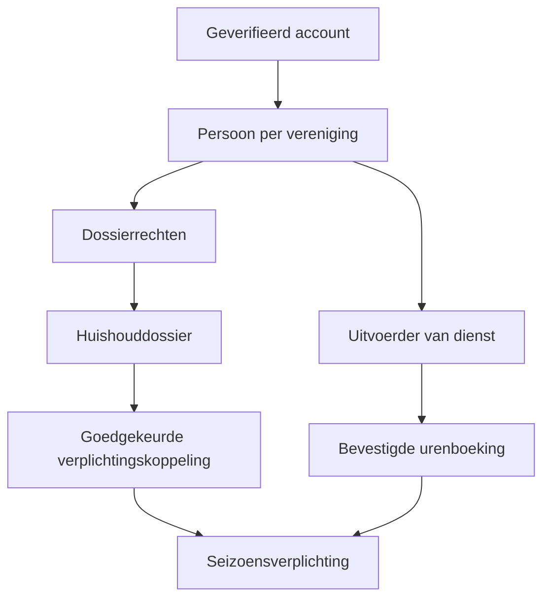

# 03 — Supabase: datamodel, identiteit en toegangsrechten

Status: implementatieontwerp voor Cluvo V1, 2 oktober 2026. Dit document beschrijft de te bouwen database; het is geen toegepaste migratie en bewijst geen werkende backend. De vastgezette V1-canon blijft leidend bij een inhoudelijk verschil.

## 1. Omgevingen en vaste uitgangspunten

Cluvo is een platform voor meerdere verenigingen. Duindorp SV is de eerste tenant, geen hardgecodeerde uitzondering. Kies één afzonderlijk managed Supabase-project voor staging en later één afzonderlijk project voor production. Deel geen database, Auth-gebruikers, buckets, webhookgeheimen of providercredentials tussen die omgevingen. Tijdens de bouw draait alleen staging; production blijft gesloten totdat de V1-releaseprocedure expliciet wordt doorlopen. Lokale ontwikkeling gebruikt een aparte lokale Supabase-stack of een aantoonbaar geïsoleerde ontwikkelomgeving.

Gebruik standaard Postgres in Supabase, Auth, private Storage en waar nodig Realtime. Kies geen experimentele database-engine voor deze V1. De gewenste ontwikkelstack is echte Next.js App Router met TypeScript. Het bestaande Vinext/localStorage-prototype is de visuele en interactionele referentie, niet het operationele datamodel.

Algemene dataconventies:

- Iedere tenantgebonden tabel heeft `id uuid`, `tenant_id uuid`, `created_at timestamptz` en waar wijzigbaar `updated_at timestamptz, version bigint`. Een globale Auth-identiteit is de uitzondering.
- Elke verwijzing tussen tenanttabellen gebruikt een samengestelde FK `(tenant_id, referenced_id)` naar een unieke `(tenant_id, id)`. Alleen een UUID-FK voorkomt geen onbedoelde verwijzing naar een andere club.
- Werk met gehele minuten, gehele eurocenten, `date` voor geboortedatum/kalenderdatums en UTC-`timestamptz` voor gebeurtenissen. Bewaar daarnaast de IANA-tijdzone van de vereniging, standaard `Europe/Amsterdam`.
- Namen, e-mailadressen, straatadressen en intakecodes zijn nooit de primaire sleutel en bewijzen geen gezinsrelatie of bevoegdheid.
- Gevoelige teksten staan in afzonderlijke beschermde tabellen, niet in een generiek JSON-veld dat ook voor teamouders beschikbaar is.
- Definitieve besluiten, tekstversies, acceptaties, financiële posten en urenboekingen worden niet overschreven. Wijzigingen maken een herziening, tegenboeking of volgende versie.
- `ON DELETE RESTRICT` voor historische en financiële relaties. Archiveren/pseudonimiseren is een gecontroleerde workflow. Geen algemene cascade vanaf een persoon of huishouden naar diens historie.
- Kritische writes lopen via de domeintransacties uit document 04. De client mag geen saldo, besluitstatus, actor-ID of betaalstatus vrij aanpassen.

`tenant_id` uit een route, formulier of cookie is een gevraagde context. De database controleert steeds dat de geauthenticeerde actor in die tenant het concrete recht heeft.

## 2. Identiteit is niet hetzelfde als een huishouden

Een account identificeert wie handelt. Een persoon beschrijft een mens binnen een vereniging. Een huishouden is een dossier met expliciete toegang. Een seizoensverplichting is de eenheid waarop minuten en een eventuele financiële afrekening worden geboekt.

Eén account kan bij verschillende verenigingen horen, maar krijgt geen cluboverschrijdend personenoverzicht. Eén geverifieerd e-mailadres is één loginidentiteit. Het is niet mogelijk om met één gedeeld ouderadres twee onafhankelijk afgeschermde accounts te maken. Een extra uitvoerder krijgt pas toegang na uitnodigingsacceptatie, e-mailverificatie en een expliciete dossiermachtiging. Een intakecode is uitsluitend een dossierverwijzing.

### Kern: accounts, organisatie en mandaten

In onderstaande tabellen zijn de algemene velden uit §1 impliciet. `UQ` betekent een af te dwingen unieke sleutel; tijdsgebonden uniekheid vraagt een geschikte gedeeltelijke index of uitsluitingsconstraint.

| Tabel | Belangrijkste velden | Relaties en invarianten |
|---|---|---|
| `tenants` | `slug, name, timezone, status, branding_json, locale` | Globale tenant-ID; `slug` uniek. Branding bevat alleen presentatie, nooit autorisatie. |
| `tenant_settings_versions` | `effective_from, approved_by, cancellation_minutes, confirmation_days, dispute_days, reminder_rules, money_rule_id` | Gepubliceerde versie onveranderlijk; verwijzingen vanuit afspraken bewaren de toen geldende versie. |
| `account_profiles` | `auth_user_id, display_name, locale` | Globaal; `auth_user_id` uniek → `auth.users.id`. Alleen eigen profiel of minimale interne lookup. Geen rol in user-editable metadata. |
| `persons` | `given_name, family_name, birth_date, birth_date_precision, membership_started_on, status` | Verenigingsgebonden mens; bronvelden niet automatisch met gegevens van een andere club samenvoegen. |
| `person_contacts` | `person_id, kind, value, verified_at, visibility_scope` | E-mail/telefoon gescheiden van algemeen persoonsprofiel; onafhankelijke ouderprivacy. Geen tenantbrede SELECT. |
| `account_person_links` | `auth_user_id, person_id, relationship=self, verified_at, revoked_at` | Maximaal één actieve zelfkoppeling per `(tenant_id, auth_user_id)` en per `(tenant_id, person_id)`. Vertegenwoordiging loopt via aparte grants. |
| `tenant_memberships` | `auth_user_id, status, starts_at, ends_at` | UQ actieve membership per tenant/account; blokkering onmiddellijk effect op nieuwe reads/writes. |
| `committees` | `name, slug, coordinator_contact_id, active` | UQ `(tenant_id, slug)`. |
| `teams` | `name, season_id, external_source_id, active` | Team is seizoensgebonden; bronkoppeling uniek. |
| `team_person_memberships` | `team_id, person_id, kind, starts_at, ends_at` | Speler/coach/teamouder zijn afzonderlijke typen; teamouderrecht ook via een gecontroleerd systeemmandaat. |
| `permission_roles` / `role_permissions` | `key, name`; `role_id, permission_key` | Systeemrechten: bijvoorbeeld `shift.publish`, `household.review`, `finance.finalize`; nooit gelijkstellen aan vrijstellende vrijwilligersfuncties. |
| `access_grants` | `auth_user_id, role_id, scope_kind, committee_id?, team_id?, household_id?, starts_at, ends_at, granted_by, renewed_at` | Exact één geldige scope via CHECK. Einddatum en intrekking worden bij elk verzoek beoordeeld. |
| `coordinator_portfolios` / `portfolio_scopes` | `coordinator_person_id, period`; `portfolio_id, committee_id?/team_id?/household_id?` | Vrijwilligerscoördinator ziet uitsluitend toegewezen portefeuille; geen impliciet centraal beheer. |
| `acting_delegations` | `actor_auth_user_id, represented_person_id, scope, starts_at, ends_at, evidence_ref, granted_by` | Namens iemand handelen vereist een specifieke bevoegdheid; logt altijd de feitelijke actor. |

Aanstellings- en portefeuillegegevens bepalen scope; vrije UI-rolkeuze doet dat niet. De rolwisselaar in productie kiest alleen tussen werkelijk toegekende werkruimtes.

### Huishoudens, intakes en seizoensverplichtingen

| Tabel | Belangrijkste velden | Relaties en invarianten |
|---|---|---|
| `households` | `label, intake_code_hash, intake_code_hint, separated_parents, status` | Unieke willekeurige intakecode per dossier; geen wachtwoord of loginrecht. Code rouleren is gelogd. |
| `household_person_links` | `household_id, person_id, kind, starts_at, ends_at, verified_by` | Eén persoon kan wegens gescheiden ouders aan twee dossiers gekoppeld zijn; dit creëert geen verplichting. |
| `household_access_grants` | `household_id, auth_user_id, can_view_progress, can_manage_contacts, can_invite_executor, can_book_for, starts_at, ends_at` | Expliciete minimale rechten. `can_book_for` wordt begrensd met aparte actor–uitvoerderregels, niet een vrij persoons-ID uit de client. |
| `guardian_authorizations` | `guardian_person_id, represented_member_id, scope, valid_from, valid_until, verified_by, evidence_ref` | Bijvoorbeeld `policy_acceptance` apart van `intake_assistance`. Leeftijd 16+ of hetzelfde dossier geeft dit recht niet automatisch. |
| `household_invitations` | `household_id, invited_email_hash, invited_person_id?, token_hash, allowed_scopes, expires_at, accepted_by_auth_id` | Eenmalig token, beperkt geldig; alleen geverifieerde matching identiteit; geen gevoelige data in uitnodigings-URL. |
| `intake_profiles` | `person_id, household_context_id, annual_confirmed_at, desired_minutes, status` | UQ actuele intake per persoon/context. Bij onafhankelijke routes eigen profiel en eigen ACL. |
| `intake_answers_versions` | `profile_id, revision, answers_json, authored_by_auth_id, represented_person_id, assistance_reason` | Versies onveranderlijk; geen diagnoses. Functionele beperkingen in beperkte ACL. |
| `skills` / `person_skills` | `code, name`; `person_id, skill_id, level, verified_by?` | Talenten zijn geen automatische certificering. |
| `task_preferences` | `person_id, category_id, preference, interest_in_fixed_role` | Persoonlijke voorkeuren; beperkt zichtbaar voor matching/begeleiding. |
| `availability_rules` / `unavailability_periods` | `person_id, timezone, recurrence`; `person_id, starts_at, ends_at, private_note?` | Boekingscontrole gebruikt praktische blokkade; planner hoeft privéreden niet te zien. |
| `seasons` | `name, starts_on, ends_on, winter_cutoff_at, target_minutes, winter_fraction, status` | Default 720 minuten, 50%; activering vereist datums/regels. Wintergrens met expliciete lokale grens → UTC. |
| `obligations` | `season_id, assessed_household_id, base_target_minutes, effective_target_minutes, effective_winter_minutes, rate_rule_id, status, current_decision_id` | Normaal één actieve verplichting per aansprakelijk huishouden/seizoen. Doelwijziging alleen via besluit. Geen saldo als vrije schrijfkolom. |
| `household_obligation_links` | `household_id, obligation_id, link_kind, starts_at, ends_at, decision_id` | `liable`, `contributor` of `progress_only`. Per verplichting exact één aansprakelijk huishouden; andere koppelingen alleen na controle. |
| `obligation_member_basis` | `obligation_id, member_person_id, basis_kind, starts_at, ends_at, decision_id` | Legt vast welke leden aanleiding geven tot de beoordeling. Gedeelde kinderen worden niet automatisch tweemaal belast. |
| `executor_obligation_grants` | `person_id, obligation_id, valid_from, valid_until, approved_by` | Uitvoerder mag uitsluitend aan deze verplichting bijdragen. Een boeking bewaart gekozen verplichting; latere dossierwijziging verplaatst historische uren niet. |
| `household_change_cases` | `kind, source_household_id, destination_household_id?, proposed_links, proposed_targets, status, decision_id` | Koppelen/splitsen/instroom/vertrek/herstel met gevolgenpreview, geen fuzzy automerge. |
| `volunteer_role_catalog` / `volunteer_role_versions` | `name, active`; `role_id, revision, household_exempt, recognition_rules` | Configuratie voor structurele inzet; aparte tabel van `permission_roles`. |
| `volunteer_appointments` | `person_id, household_id, role_version_id, committee_id?/team_id?, starts_on, ends_on, recognized_by, status, annual_confirmed_at` | Snapshot van erkenning/vrijstelling; geen systeemrechten en geen fictieve uren. |
| `obligation_coverage_decisions` | `obligation_id, appointment_id?/exception_case_id?, household_id, scope, starts_at, ends_at, effect, effective_target_minutes, effective_winter_minutes` | Alleen effect binnen expliciet besluit. Een rol in dossier A kan nooit stilzwijgend een verplichting van dossier B vrijstellen. |
| `winter_reviews` / `winter_allocations` | `obligation_id, cutoff_at, ledger_revision, pending_count, deficit_minutes, status`; `review_id, booking_id, allocated_minutes, state` | UQ winterreview/obligation/grens. Actieve allocaties dekken maximaal het vastgestelde tekort; annulering maakt allocatie opnieuw open. |

**Concrete scheidingsregel:** een nieuw ouderaccount of tweede intake verandert niets aan `obligations`. Bij een werkelijk tweede dossier besluit de commissie of het dossier alleen een expliciete uitvoerders-/voortgangskoppeling krijgt, of een eigen beoordeelde verplichting. Als een bestaande verplichting wordt verdeeld, legt het besluit de nieuwe doelen en de behandeling van eerdere inzet vast voordat nieuwe bijdragen worden geboekt. Historische bookings en ledgerregels blijven op hun oorspronkelijke verplichting staan. Een vrijstelling volgt de erkende aanstelling en de verplichting van het daarbij aangewezen huishouden; geen automatische verspreiding via een gedeeld kind of contactadres.

Deze keuze voorkomt zowel een dubbele 12-uursclaim als het onbedoeld delen van privégegevens. Een structureel eindigende rol zet de verplichting zo nodig op `review_hold`; hij maakt geen ongemotiveerde terugwerkende financiële claim.

## 3. Taken, planning, uitvoering en controleerbare uren

| Tabel | Belangrijkste velden | Relaties en invarianten |
|---|---|---|
| `task_categories` | `committee_id, name, order_index` | Bijvoorbeeld Bar, Keuken, Onderhoud; categorie binnen commissie. |
| `task_types` / `task_type_versions` | `category_id, name, active`; `revision, requirements_json, credit_minutes_rule, cancellation_minutes_override, club_cancellation_rule, approval_id` | Nieuwe typen/afwijkende urenwaarden vragen mandaat of goedkeuring. Gepubliceerde afspraken verwijzen naar een versie. |
| `roster_lanes` | `category_id, name, ordinal, active` | Bijvoorbeeld Bar 1–3 en Keuken 1–2; planbordrij is niet noodzakelijk een vaste persoon. |
| `roster_templates` / `roster_template_blocks` | `committee_id, name, revision`; `template_id, category_id, lane_index, local_start, duration_minutes, capacity, type_version_id` | Templates genereren concepten; niet direct meldingen of boekingen. |
| `shifts` | `type_version_id, committee_id, category_id, title, starts_at, ends_at, location_id, credit_minutes, state, published_at, publication_event_id, source_match_id?, source_event_id?, source_team_task_id?` | CHECK einde > begin, credit ≥0. Eerste publicatie heeft stabiele gebeurtenis. Kleine edit is geen nieuwe taak. |
| `shift_positions` | `shift_id, lane_id?, ordinal, starts_at, ends_at, state` | Een concrete bezettingsplaats; UQ `(tenant_id, shift_id, ordinal)`. Capaciteit = actieve plaatsen. Eén plaats kan door opeenvolgende tijdblokken op dezelfde lane worden weergegeven. |
| `shift_requirements` | `shift_id, minimum_age, qualification_id?, valid_at, min_qualified_count, buddy_allowed` | Bevoegdheidscontrole geldt voor diensttijd, niet alleen boekdatum. Groepsbezetting apart van individuele geschiktheid. |
| `shift_instruction_links` | `shift_id, document_version_id, required_ack, offered_at` | Gevolgde/gewijzigde instructie traceerbaar; nieuwe versie kan herbevestiging vragen. |
| `bookings` | `position_id, executor_person_id, obligation_id, state, booked_by_auth_id, starts_at_snapshot, ends_at_snapshot, credit_minutes_snapshot, cancellation_deadline_snapshot, task_version_snapshot, buddy_booking_id?, supersedes_booking_id?` | Eén actieve booking per position; één actieve booking per uitvoerder/overlappende tijd binnen tenant. Snapshot komt van server. |
| `booking_events` | `booking_id, event_type, actor_auth_id, represented_person_id?, reason_code, payload, occurred_at` | Append-only status-/afspraakgeschiedenis. Geen medische details in algemeen payload. |
| `attendance_decisions` | `booking_id, decision_revision, result, awarded_minutes, confirmed_by_auth_id, reason, previous_decision_id?` | Bevoegde coordinator; correctie is nieuwe beslissing. No-show default nul; afwijking gemotiveerd en binnen mandaat. |
| `hour_ledger_entries` | `obligation_id, season_id, booking_id?, approved_manual_case_id?, attendance_decision_id, minutes_delta, performed_at, posted_at, actor_auth_id, reverses_entry_id?, correction_reason, idempotency_key` | Append-only, geen UPDATE/DELETE door approllen. UQ `(tenant_id, idempotency_key)`; iedere positieve post heeft één geldige uitvoeringsbron. Tegenboeking verwijst naar bestaande post. |
| `hour_disputes` | `booking_id?/ledger_entry_id?, obligation_id, opened_by, description, state, assigned_to, resolution_decision_id` | Open geschil blokkeert betrokken definitieve afrekening; administratieve fout blijft herstelbaar na meldtermijn. |
| `swap_requests` / `swap_consents` | `origin_booking_id, counterpart_booking_id?, mode, state, expires_at`; `request_id, auth_user_id, person_id, consented_version` | Originele booking blijft geldig tot transactionele vervanging. Wederzijdse ruil vraagt twee expliciete instemmingen. |
| `waitlist_entries` | `shift_id, person_id, obligation_id, joined_at, priority_rank, state` | UQ actieve persoon/shift; FIFO tenzij vooraf vastgelegd passendheidsbeleid. |
| `waitlist_offers` | `entry_id, position_id, offered_at, expires_at, state, consumed_booking_id` | Maximaal één actieve hold per position. Geaccepteerd aanbod en booking ontstaan samen. |
| `reserve_pool_memberships` | `person_id, categories, allowed_times, max_notice_minutes, consented_at, active` | Vrijwillige invalbereidheid; geen stille taaktoewijzing. |
| `shift_change_proposals` | `shift_id, expected_version, proposed_values, impact_snapshot, state, approved_by` | Controleert bezetting, geschiktheid, instructies, ruimte- en gezinsconflicten; toegepaste versie kan herbevestiging vragen. |
| `qualification_types` / `person_qualifications` | `name, issuer_rules`; `person_id, type_id, achieved_at, expires_at, verified_by, evidence_document_id?` | Certificaat moet geldig zijn voor gehele vereiste dienstperiode. Geen diagnosebewijs. |

Gebruik voor persoonlijke boekingsconflicten een database-uitzonderingsconstraint op een halfopen tijdsinterval `[start, end)` voor actieve bookings, bijvoorbeeld een GiST range met `btree_gist` indien beschikbaar. De lock- en transactieroute blijft nodig voor capaciteit, holds en ruilen. Een snelle UI-check is geen bescherming tegen twee gelijktijdige aanmeldingen.

`confirmed_minutes = som(minutes_delta)` over de betrokken verplichting. Voor winter telt de uitvoeringsdatum `performed_at` ten opzichte van de wintergrens, niet de datum waarop de coordinator later bevestigt. Een correctie bewaart de feitelijke uitvoeringscontext. Geplande, uitgevoerde-nog-onbevestigde, bevestigde en betwiste minuten zijn afzonderlijke projecties. Een rolvrijstelling is een dekkingsstatus en voegt nul ledgerminuten toe.

## 4. Samenwerking, agenda en communicatie

| Tabel(groep) | Velden en koppelingen | Integriteit / privacy |
|---|---|---|
| `kanban_boards`, `kanban_columns` | `committee_id, name`; `board_id, title, position, terminal` | Eigen commissie; kolommen configureerbaar. |
| `kanban_cards` | `board_id, column_id, title, description, priority, starts_on, due_at, accountable_person_id?, version` | Kaartafronding heeft geen uren-effect. |
| `card_assignees`, `card_labels`, `card_subtasks`, `card_checklist_items` | `card_id, person_id`; labelrelatie; subtaak met eigen status/deadline; checklisttekst | Meerdere assignees toegestaan. `subtask_assignees` ondersteunt meerdere uitvoerders per subtaak. UQ per koppeling. |
| `card_links`, `card_history` | FK's naar event/match/shift/document; actor en wijzigingen | Typed links met echte FK, geen ongecontroleerde willekeurige resource-ID. Link verleent geen inzage. |
| `conversations`, `conversation_participants`, `messages` | scope/committee/team/household, deelnemers, berichtinhoud, auteur, versie | Besloten gesprekken vereisen expliciete deelname én geldige bronrechten. |
| `comments`, `mentions` | Typed bron-FK, tekstversie, auteur; `recipient_person_id, event_id` | UQ event/ontvanger/bron; mention alleen aan reeds bevoegde persoon. |
| `documents`, `document_versions`, `document_acl` | eigenaar, broncontext, zichtbaarheid; revision, storage_object_id, content_hash; expliciete grants | Versies zijn onveranderlijk; links/zoekresultaten/downloads dezelfde rechten als bron. |
| `team_tasks` | `team_id, title, due_at, credit_minutes=0, assigned_person_id?, state` | Teamouder kan geen positieve urenwaarde schrijven. |
| `team_task_market_requests`, `market_approvals` | `team_task_id, referee_needed, match_review_status, volunteer_review_status, approved_minutes, shift_id` | Scheidsrechterverzoek vereist beide beoordelingen; UQ uitgegeven markttaak per goedgekeurd verzoek. |
| `events`, `event_occurrences`, `event_attendees` | scope, organisator, lokale tijd/zone, recurrence-rule; concrete start/einde; RSVP/status | Eén bron met concrete occurrences; unieke `series_id + recurrence_key`; uitzonderingen bij verplaatsing/annulering. |
| `locations`, `event_resource_bookings` | locatiegegevens; `location_id, occurrence_id, time_range` | Overlap signaleren; hard of zacht volgens ingericht locatiebeleid. |
| `matches`, `match_revisions`, `match_change_impacts` | bron-ID, team, tegenstander, start, locatie, status, bronhash; vorige waarden; gekoppelde shifts met beoordelingsstatus | UQ tenant/provider/source-ID. Matchimport wijzigt geen bestaande dienstbelofte. |
| `personal_action_items` | `recipient_person_id, source_event_id, source_kind, due_at, state` | Eén ontvanger/bronactie; projectie van toegestane bronnen, geen kopie van beschermde volledige teksten. |
| `vacancies`, `vacancy_interests`, `appointment_cases` | rolversie, werkzaamheden, begeleiding; persoon/status; goedgekeurde aanstelling | Belangstelling ≠ aanstelling ≠ recht ≠ vrijstelling. |
| `courses`, `course_sessions`, `course_enrollments` | opleiding, datum/locatie, persoon/status/resultaat | Resultaat kan na verificatie kwalificatie opleveren; losse deelname doet dat niet automatisch. |
| `appreciation_rules`, `appreciation_occasions`, `appreciation_actions` | brontype/mijlpaal/actie; persoon + gelegenheid + jaar; eigenaar, uitvoerders, deadline, budgetverwijzing, status | UQ tenant/persoon/gelegendheid/mijlpaal/periode. Besloten lief-en-leedtekst in afzonderlijke private tabel. |
| `workload_preferences`, `workload_alerts`, `supply_assessments` | gewenste inzet; periode/reden/eigenaar; verplichting/categorie/periode/passende capaciteit | Signalering ondersteunt gesprek; geen automatische sanctie. |

### Templates, meldingen, beleid en financiële administratie

| Tabel(groep) | Velden en koppelingen | Belangrijkste constraint |
|---|---|---|
| `notification_categories`, `notification_preferences` | kanaaltype/verplichtkarakter; persoon/kanaal/categorie/keuze | Eén actuele voorkeur per persoon/kanaal/categorie; beleidsacceptatie blijft apart. |
| `message_templates`, `message_template_versions` | type/eigenaar; revision, subject, preheader, HTML/text, variable_schema, status, approval_actor | Gepubliceerde versie onveranderlijk; veilige variabelen, goedgekeurde afzender. |
| `template_test_runs`, `delivery_rules` | testpersoon/snapshot/resultaat; trigger/doelgroep/timing/templateversie | Geen echte verzending vanuit preview; testadres expliciet en staging-allowlist. |
| `domain_events` | `aggregate_type, aggregate_id, aggregate_version, event_type, payload_minimal, occurred_at` | Transactioneel met domeinwrite; UQ aggregate/version/event_type. |
| `notification_intents` | `domain_event_id, recipient_person_id, category, channels, dedupe_key, status` | UQ tenant/dedupe_key; toewijzing+mention combineren. |
| `task_offer_candidates`, `daily_task_digests`, `daily_digest_items` | persoon/task/publication; persoon/local_date/timezone/status; digest/task | UQ push-event per tenant/persoon/task; UQ digest per tenant/persoon/lokale datum. |
| `notification_outbox`, `delivery_attempts`, `provider_delivery_events` | ontvanger, channel, templateversion, bodyhash, due_at, lease_until, providerkey; pogingstatus; provider-event-ID | UQ channel/dedupekey; provider-webhook-ID uniek. Status `accepted` is niet `delivered`. |
| `inbox_items`, `push_subscriptions` | persoon/intent/read_at; authuser/device/endpoint/keys/revoked_at | Eén logisch inboxbericht per intent; pushendpoint uniek. Authsecrets niet in algemeen log. |
| `segments`, `segment_rules`, `segment_snapshots` | eigenaar/scope, toegestane filters, ontvanger-ID's bij verzending | Gebruik alleen velden waarvoor maker én verzendroute bevoegd zijn. Geen diagnosefilter. |
| `policy_documents`, `policy_versions` | type/eigenaar; revision, immutable_body, body_hash, file_id, effective_at, approval_actor | Gepubliceerde tekst en download exact dezelfde versie; niet achteraf aanpassen. |
| `policy_audiences`, `policy_assignments` | versie/doelgroep; member_person_id, due_at, offered_at, opened_at, state | UQ tenant/member/version. Geen household-only akkoord. |
| `policy_acceptances` | `assignment_id, member_person_id, version_id, version_hash, actor_auth_id, actor_person_id, capacity, guardian_authorization_id?, accepted_at, confirmation_event_id` | UQ member/version; serverdatum; expliciet akkoord en geldige vertegenwoordiging. Geen opslag van OTP. |
| `policy_questions` | `assignment_id, author, state, handler, resolution` | Vraag stopt toepasselijke herinnering; blijft los van acceptatie. |
| `exception_cases`, `exception_case_revisions` | type/obligation/aanvrager; voorstel, scope, doelen, looptijd, motivering, hash | Elke wijziging aan voorstel creëert nieuwe revision. Persoonlijke toelichting apart van financieel besluit. |
| `exception_reviews` | `case_revision_id, reviewer_auth_id, reviewer_person_id, outcome, reason, reviewed_at` | UQ revision/reviewer_auth_id én revision/reviewer_person_id. Minimaal twee verschillende echte beoordelaars. |
| `exception_decisions` | `case_revision_id, outcome, effective_target_minutes, effective_winter_minutes, valid_from, valid_until, financial_route, approved_at` | Alleen maken na geldige beoordelingsroute. Conflicterend oordeel/belang → bestuur. |
| `financial_assessments`, `assessment_revisions` | obligation/season/route/status; ledgerrevision, decision-set-hash, missing_minutes, rate numerator/denominator, cents, blockers | Eén actieve finale route per verplichting/seizoen: buyout óf shortage. Geen betaalclaim uit puur UI-saldo. |
| `invoices`, `invoice_lines`, `payment_events`, `financial_corrections` | assessmentrevision, factuurnr/status; bedrag/reden; provider/transactie; oude post/tegenpost | Unieke factuurnummers en externe transactie-ID's; definitieve posten niet verwijderen. |
| `volunteer_fund_entries`, `fund_reservations`, `fund_expense_approvals` | ontvangst/uitgave/tegenpost in centen; doel/eigenaar/status; beoordelaar | Ontvangen bijdrage ≠ open factuur. Reservering ≠ uitgegeven geld. |
| `season_close_runs`, `season_snapshots`, `rollover_runs` | season/status/controlehash; minuten/doelen/besluiten/exportversie; bron/doel/gekozen templates | Idempotente rollover; geen automatisch meenemen van extra uren. |
| `integration_connections`, `integration_runs`, `import_batches`, `import_rows` | provider/status/credentialref; trigger/tijden/resultaat; mapping/checksums; bron-ID/validatiefouten | Credentials buiten publiek schema. Failed/incomplete import verwijdert geen bronrecords. |
| `scheduled_occurrences`, `job_runs` | jobkind/localdate/slot/timezone/scheduled_utc/state; lease/resultaat | UQ tenant/job/localdate/slot; voorkomt dubbele DST-/retry-uitvoering. |
| `audit_events`, `idempotency_records` | actor/namens/context/actie/resource/reason/requestid; actor/op/key/requesthash/result | Audit append-only; hergebruik key met andere payload weigeren. Geen OTP/secrets/diagnoses in auditpayload. |

## 5. RLS en kolombeperking

Activeer RLS op alle applicatietabellen in aan de Data API aangeboden schema's, en defensief op private tabellen. Grant alleen de benodigde operaties. Voor kritische tabellen zijn directe client-INSERT/UPDATE/DELETE ingetrokken. Gebruik smalle leesprojecties en een vastgelegde commandroute. Financiële en private intakekolommen mogen niet via een brede `select('*')` op een voor teamouders leesbare tabel bestaan.

Voor views op Postgres 15+ geldt `security_invoker=true`, tenzij ze uitsluitend via een gecontroleerde serverroute beschikbaar zijn en publieke rechten expliciet ontbreken. Exporteer beschermde aggregateviews niet als onbeveiligde view met eigenaarsrechten. UPDATE-policies vereisen zowel `USING` als `WITH CHECK`, inclusief onveranderlijke tenant en eigenaar.

### Lees-/schrijfmatrix

`Eigen` betekent expliciet geautoriseerd; niet alleen gelijk e-mailadres of adres. `Scope` betekent de geldige committee/team/portefeuille. `Besluit` betekent de beperkte beoordelingsroute, niet onbeperkte CRUD.

| Gegeven of actie | Lid/ouder/uitvoerder | Commissiecoördinator | Vrijwilligerscoördinator | Vrijwilligerscommissie | Teamouder | Bestuur | Financieel |
|---|---|---|---|---|---|---|---|
| Persoonlijke intake/contact | Eigen; apart ouderprofiel | Alleen praktische geschiktheidsuitkomst | Toegewezen begeleiding | Dossierbevoegd | Geen privéantwoorden | Alleen expliciet bevoegde zaak | Geen |
| Huishoudvoortgang | Eigen grants | Dienstspecifiek | Portefeuille | Vereniging | Eigen teams, gereduceerde projectie | Aggregate; dossier bij apart mandaat | Berekening en betalingsrelevante identificatie |
| Vrijstellingsreden | Eigen binnen ACL | Geen | Alleen zaakmandaat | Bevoegde zaak | Geen, alleen “Geen actie nodig” | Bevoegde beslissing/bezwaar | Uitkomst, geen privéreden |
| Diensten publiceren/plannen | Inschrijven op passend aanbod | Eigen commissie/mandaat | Alleen toegekend planningsmandaat | Centrale bevoegdheid | Alleen verzoek | Geen automatisch operationeel recht | Geen |
| Uitvoering bevestigen | Vraag/correctie indienen | Eigen diensten | Alleen toegekend mandaat | Geautoriseerde controle | Geen uit teamouderrol | Alleen apart mandaat | Geen |
| Urenledger | Eigen voortgang/historie | Eigen bevestigde dienstinformatie | Portefeuille | Controle/correctietransactie | Alleen getallenprojectie | Aggregate/audit bij mandaat | Berekeningsregels relevante afrekening |
| Huishoudkoppeling/uitzondering | Aanvraag | Geen | Voorbereiden binnen portefeuille | Besluitroute | Geen | Escalatie/belang/bezwaar | Definitief financieel resultaat |
| Commissiekanban/documenten | Bij expliciete commissie-/bronrechten | Eigen commissie | Toegewezen werkruimte | Niet automatisch alle besloten bronnen | Alleen eigen teambronnen | Niet automatisch alle besloten bronnen | Alleen financiële bronrechten |
| Templates/verzendregels | Eigen kanaalvoorkeur | Berichten uit goedgekeurde scope-template | Scopecommunicatie | Centrale communicatie indien toegekend | Eigen teamcommunicatie | Centrale inrichting indien toegekend | Alleen betaalcommunicatie |
| Beleidsacceptatie | Zelf of expliciet vertegenwoordigd lid | Voortgang alleen benodigd in scope | Portefeuilleopvolging | Bevoegde opvolging | Beperkte teamopvolging zonder privébezwaar | Publicatie + geautoriseerd overzicht | Geen algemene acceptatiedetails |
| Financiële gegevens/pot | Eigen toegestane afspraak | Alleen eigen goedgekeurd actiebudget | Geen algemene achterstanden | Afrekeningsvoorbereiding | Geen | Aggregate/budgetbesluiten | Goedgekeurde verwerking |

Bestuur is geen universele “lees alles”-uitzondering. Een platformbeheerder krijgt evenmin stilzwijgend toegang tot clubdossiers. Technische ondersteuning gebruikt een apart, tijdelijk, gelogd supportmandaat met concrete scope; geen verborgen impersonatieknop.

### Databasefuncties en actorverificatie

Standaard: invokerrechten met RLS. Voor een gecontroleerde atomaire command die niet met directe tabelwrites mag worden nagebootst, kan een klein, expliciet beoordeeld intern `SECURITY DEFINER`-commando nodig zijn. Plaats zo'n functie in een niet-blootgesteld schema, gebruik een minimale eigenaar zonder algemene beheermacht, vast `search_path`, volledige objectnamen en herleid de actor uit de geverifieerde sessie. Revoke standaard `EXECUTE` van PUBLIC/anon; verleen alleen de benodigde wrapper/serverroute. Controleer rol, tenant, scope, status en geldigheidsperiode opnieuw binnen de transactie. Voeg een negatieve autorisatietest toe voor iedere privileged command.

De normale Next.js-webserver gebruikt voor gebruikersacties het gebruikers-JWT en RLS; geen algemene `service_role`-client als vervanging voor autorisatie. Een background worker gebruikt een afzonderlijk server-only geheim en smalle interne opdrachten. Een door de client aangeleverd `actor_auth_id` wordt nooit vertrouwd. Een request-ID of HMAC is geen vervanging voor domeinrechten.

Gebruik actuele membership/grant-tabellen voor onmiddellijke intrekking; JWT-user-metadata of een verouderde rolclaim mag niet beslissend zijn. SSR verifieert de identiteit met de ondersteunde Supabase-methode; vertrouw niet alleen een clientcookie of `getSession()` als autorisatiebewijs.

## 6. Storage, Realtime, zoeken en exports

Private buckets per datatype, bijvoorbeeld `club-documents`, `member-attachments`, `policy-versions` en `restricted-case-files`. Objectpad: `tenant_uuid/resource_uuid/version_uuid/random_filename`. Bucketnaam/pad is alleen ordening; Storage-RLS controleert tenant, metadataresource en bron-ACL. Geen medische bewijsstukken opvragen. Toegestane uploads krijgen grootte-, MIME- en bestandscontroles; download pas na verwerking. Vermijd uitvoerbare HTML in een vertrouwde domeincontext.

Gepubliceerde documentversies worden niet ge-upsert. Een nieuwe versie is een nieuw object. Een downloadroute hercontroleert bronrechten en maakt eventueel een korte signed URL. Signed URLs blijven tot hun vervaldatum bruikbaar; gebruik voor direct intrekbare besloten informatie een geauthenticeerde proxy of zeer korte geldigheid. Een publiek bestand mag uitsluitend bewust goedgekeurde, niet-persoonlijke branding bevatten.

Realtime ondersteunt invalidatie van planbord, kanban en persoonlijke inbox. Payloads bevatten hoogstens bron-ID, nieuwe versie en gebeurtenistype; de client leest de inhoud opnieuw via RLS. Zo ontvangt een ingetrokken gebruiker ook bij een kort resterende socketverbinding geen gevoelige nieuwe inhoud. Gebruik private channels met geautoriseerde tenant/scope-topicnamen. Herautoriseer/reconnect bij account- of rollenwisseling en test intrekking. Maak geen eigen tabellen/functies in het door Supabase beheerde `realtime`-schema; alleen de ondersteunde policies op `realtime.messages` aanpassen.

Zoekindexen en rapportcache krijgen dezelfde tenant/scope. Global search retourneert geen titel/snippet van een onleesbaar privé-item. CSV/PDF-export is een geautoriseerde serverjob met gefixeerde scope en gelogde download, geen `service_role SELECT *` achter een knop. Een teamouderexport heeft uitsluitend de gereduceerde voortgangskolommen. Gebruik voor financiële export het afgesloten berekeningssnapshot.

## 7. Indexen en bewijs vóór acceptatie

Indexeer alle FK's, scopevelden en frequente RLS-lookups: `(tenant_id, auth_user_id, active-period)`, `(tenant_id, household_id)`, `(tenant_id, committee_id, starts_at)`, `(tenant_id, obligation_id, performed_at)`, `(tenant_id, recipient_person_id, state, due_at)`. Gebruik partiële indexes voor actieve bookings/holds/open outbox en een unieke index voor iedere idempotentiesleutel. Vermijd onbegrensde JSONB-scans voor planning of rechten.

Verplichte databaseproeven: tenant A kan tenant B nooit lezen/schrijven; twee onafhankelijke ouders kunnen elkaars intake niet lezen via REST, RPC, Storage, export of zoekresultaat; ingetrokken rol werkt direct niet meer; teamouder ziet geen privéreden/financiën; ledger-UPDATE wordt geweigerd; twee verschillende rolkeuzes van hetzelfde account tellen niet als twee beoordelaars; gedeeld kind veroorzaakt geen dubbele verplichting; de laatste plek en wederzijdse ruil blijven correct bij concurrency. Neem SQL/RLS-tests én serverroute-tests op; UI-tests alleen bewijzen geen gegevensisolatie.

## 8. Officiële technische bronnen

Geraadpleegd op 2 oktober 2026. Dit ontwerp gebruikt een beperkte samenvatting van deze productdocumentatie; de Cluvo-domeinregels komen uit de canon. Controleer bij de feitelijke implementatie de dan actuele versies en pin dependencies/lockfiles.

- [Supabase Next.js SSR](https://supabase.com/docs/guides/auth/server-side/nextjs): cookieclients, geverifieerde claims en veilige sessieverversing.
- [Email OTP](https://supabase.com/docs/guides/auth/auth-email-passwordless): OTP-template en `signInWithOtp`/`verifyOtp`.
- [Row Level Security](https://supabase.com/docs/guides/database/postgres/row-level-security): policies en views.
- [Storage access control](https://supabase.com/docs/guides/storage/security/access-control) en [Realtime authorization](https://supabase.com/docs/guides/realtime/authorization).
- [Realtime-schemawijziging](https://supabase.com/changelog/realtime-schema-locked-down-against-modification): beheer alleen de toegestane policies.
- [Expliciete Data API-grants](https://supabase.com/changelog/45329-breaking-change-tables-not-exposed-to-data-and-graphql-api-automatically): schema-exposure en grants afzonderlijk van RLS configureren.
- [Node 20-support vervallen](https://supabase.com/changelog/45715-deprecation-notice-dropping-support-for-node-js-20): gebruik een ondersteunde Node-versie van minstens 22, passend bij de gekozen Next.js-versie.
- [Postgres ranges](https://www.postgresql.org/docs/current/rangetypes.html) en [locking](https://www.postgresql.org/docs/current/explicit-locking.html): basis voor de voorgestelde overlap- en transactiebescherming.

De markdownversie van de changelog was via de zoektool niet uitleesbaar; de officiële HTML-changelog en de relevante afzonderlijke wijzigingspagina's zijn gecontroleerd.
